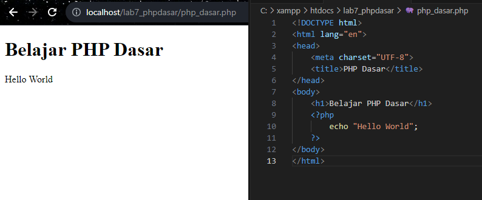
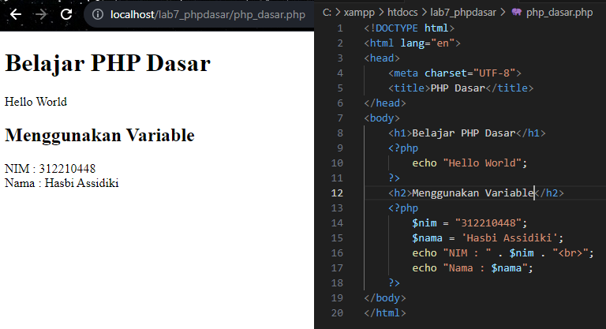
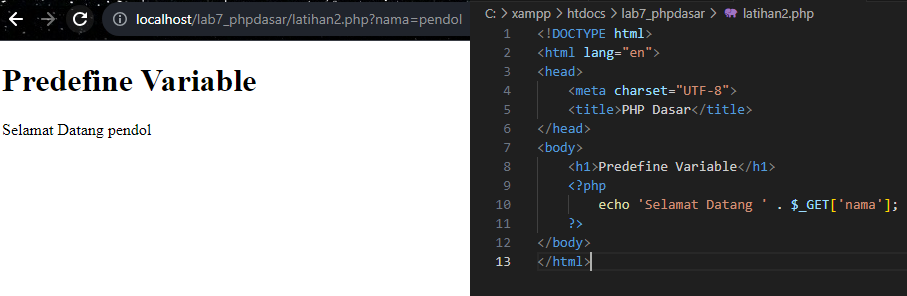
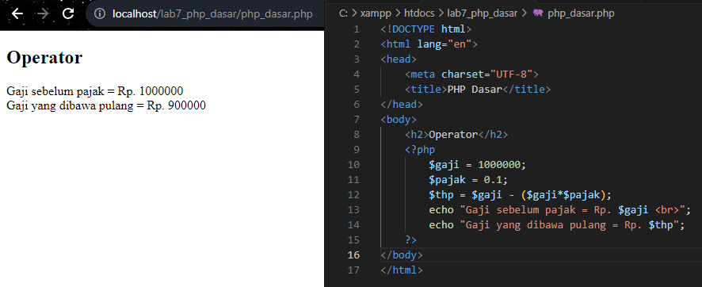
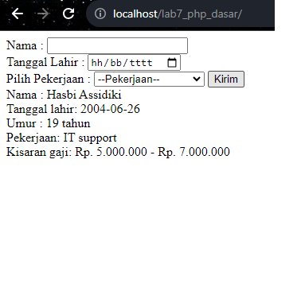

# Lab7Web
```
Nama    : Hasbi Assidiki
NIM     : 312210448
Kelas   : TI.22.A4
```

## Latihan

### PHP Dasar  
  

### Variable PHP
  

### Predefine Variable $_GET
  

### Membuat Form Input
  

### Operator
  

### Kondisi If
  

### Kondisi Switch
  

### Perulangan For
  

### Perulangan While
  

### Perulangan dowhile
  

## Tugas
Buatlah program PHP sederhana dengan menggunakan 

  